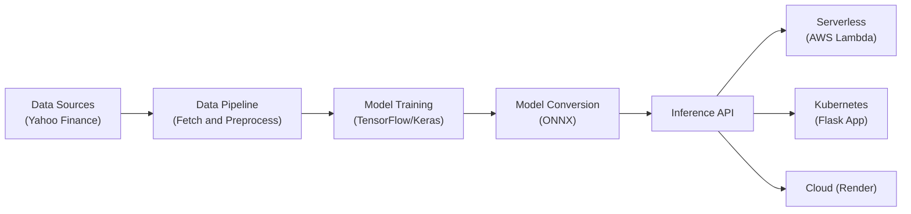

# Capstone 2: ASEAN Investment Vehicle Analysis

## Problem Statement

Investors in the ASEAN region often face challenges in comparing different investment vehicles (Stocks, ETFs, REITs, Mutual Funds) across borders. This project aims to use Deep Learning to analyze historical performance and risk metrics to predict the **suitability** or **future risk-adjusted performance** of these assets.

The goal is to build a model that can classify an investment vehicle as "Attractive" or "Unattractive" based on its historical volatility, return, and macro-economic factors (if available).

## Improvements in Capstone 2

This iteration introduces significant enhancements:

1. **Enhanced EDA**: A new detailed notebook `notebook_improved.ipynb` featuring:
    - **Correlation Heatmaps**: To analyze feature relationships.
    - **Distribution Plots**: Risk/Return profiles for class separation.
    - **Technical Indicators**: Visual overlays of RSI and MACD for signal confirmation.
2. **Live Cloud Deployment**:
    - Fully configured for **Render** deployment.
    - Includes `render.yaml` for infrastructure-as-code.
    - Dockerized with `gunicorn` for production-grade serving.

## Dataset

Data will be sourced from **Yahoo Finance (`yfinance`)**.
Key Markets: Singapore, Malaysia, Indonesia, Thailand, Philippines, Vietnam.
Asset Classes:

- **ETFs**: Country specific ETFs.
- **REITs**: High dividend yielding Real Estate Investment Trusts.
- **Stocks**: Blue chip banking and telecommunication stocks.

## Methodology

1. **Data Collection**: Script to download daily OHLCV data.
2. **Preprocessing**: Calculate technical indicators (RSI, MACD, Bollinger Bands) and Risk Metrics (Sharpe Ratio, Volatility).
3. **Modeling**:
    - Neural Network (TensorFlow/Keras).
    - Baseline: Random Forest / XGBoost.
4. Initialize DB/Files: `bash run_pipeline.sh`

## Architecture



## Deployment Instructions

### 1. Cloud (Render) - Recommended

This project includes a `render.yaml` Blueprint for easy deployment.

1. Push code to GitHub.
2. Connect repository to [Render](https://dashboard.render.com).
3. Render will auto-deploy the `capstone2-app` service.

### 2. Serverless (AWS Lambda)

The Lambda function is containerized using Docker and ONNX Runtime.

```bash
# Build the image
docker build -t capstone1-lambda -f Dockerfile.lambda .

# Run locally (Simulated Lambda)
docker run -d -p 8080:8080 --name lambda-test capstone1-lambda

# Test
python test_lambda.py
```

### 3. Kubernetes (Kind)

The Flask serving app is deployed using Kubernetes manifests.

```bash
# Build the app image
docker build -t capstone1-app -f Dockerfile.k8s .

# Create Cluster (if not exists)
kind create cluster --name capstone

# Load image into Kind
kind load docker-image capstone1-app --name capstone

# Deploy
kubectl apply -f kube/

# Port Forward (to access locally)
kubectl port-forward svc/capstone-app-service 9696:80

# Test
curl http://localhost:9696/health
curl -X POST -H "Content-Type: application/json" -d '{"features": [0.01, 0.02, 0.05, 0.01, 55.0, 0.5, 0.4]}' http://localhost:9696/predict
```

 **Deployment**:
    - **Cloud**: Render Web Service (Live Public Endpoint).
    - **Serverless**: AWS Lambda (simulated) for inference.
    - **Kubernetes**: Scalable web service for predictions.

## Tech Stack

- **Python 3.11**
- **Pandas, NumPy, Scikit-Learn**
- **TensorFlow / Keras**
- **Flask / FastAPI**
- **Docker & Kubernetes (Kind/Minikube)**
- **AWS Lambda & Render (Cloud)**

## Setup

1. Create venv: `python -m venv .venv`
2. Activate: `source .venv/bin/activate`
3. Install: `pip install -r requirements.txt`

## Acknowledgments

- **ML ZoomCamp 2025** by [DataTalks.Club](https://datatalks.club/) - For the comprehensive machine learning engineering curriculum
- **Google Antigravity** - AI coding assistant for development support and best practices
- **Yahoo Finance API** - For providing financial market data
- **Open Source Community** - For the amazing tools and frameworks (TensorFlow, Keras, Flask, Docker, Kubernetes)
